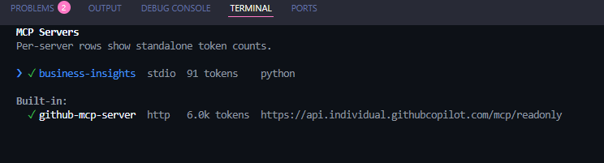
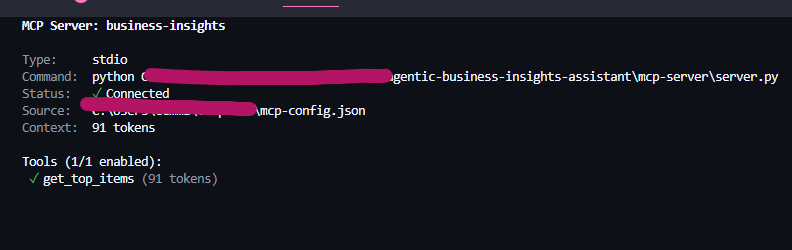

#  Running MCP Server in copilot-cli

1. register server in PS -> copilot mcp add business-insights-demo -- python "root\mcp-server\server.py"

2. start / open copilot cli

3. use /mcp command to see if server listed & connected. Tools will be listed

