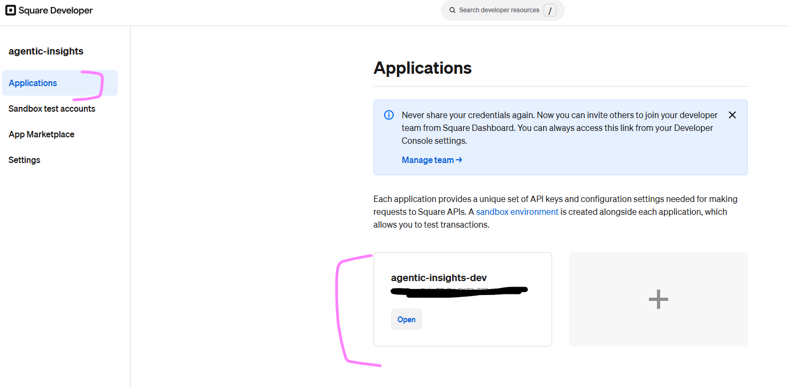
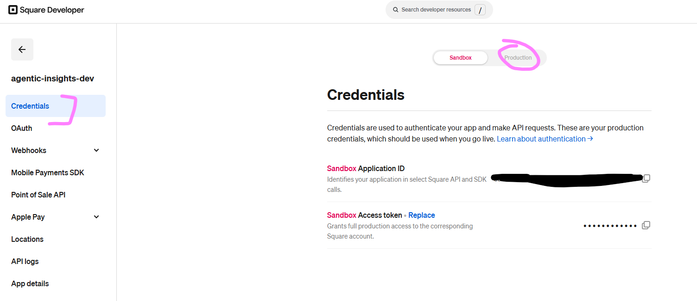
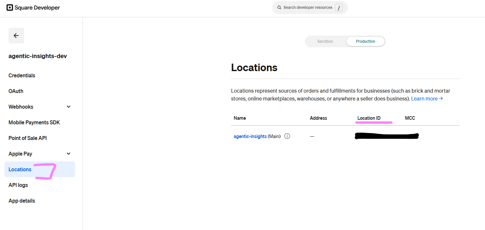
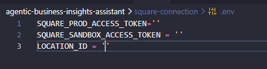
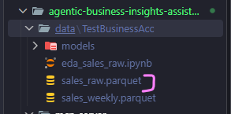

# Fetching sales data from Square

# 1 - Add Square production tokens
Access to Square APIs requires a JWT token, these tokens can be retrieved from https://developer.squareup.com/apps




Location ID is also is required and can be copied from the locations tab:



# 2 - Update environment variables
Open .env file & paste production token and location ID



# 3 - Trigger ingestion
Open a new powershell terminal and run the command:
```powershell
python -m ingestion.runner
```

A new parquet file named sales_weekly.parquet will be created

